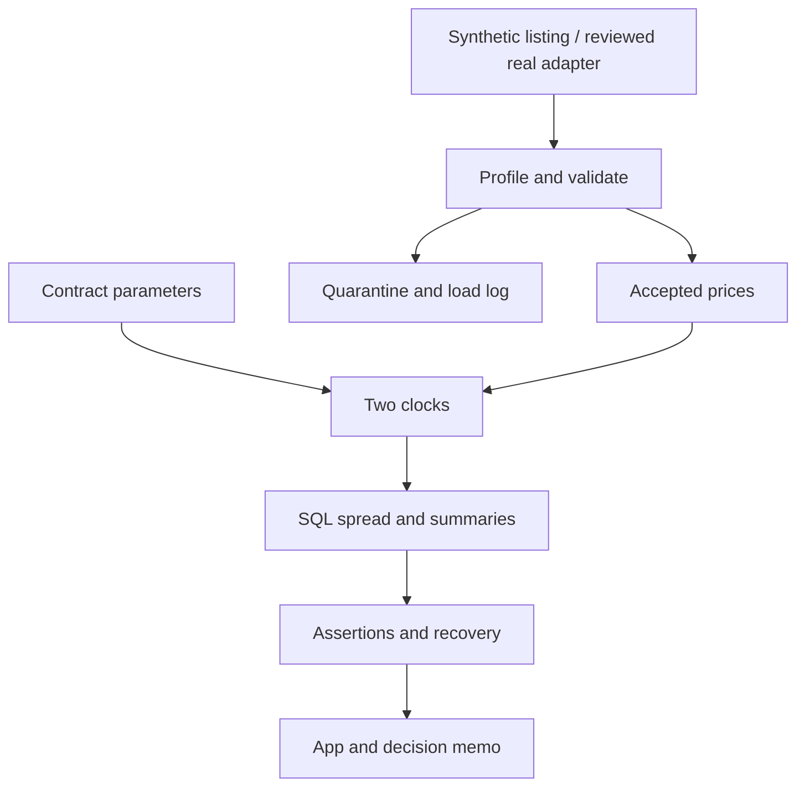
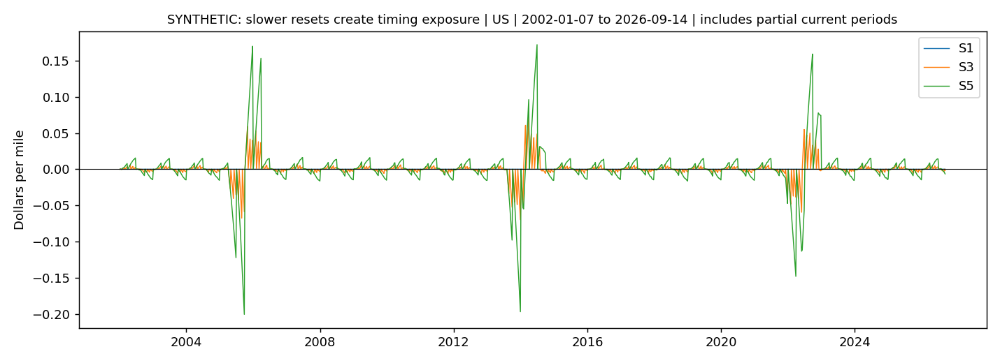

# The Broker’s Two Clocks

**SYNTHETIC DRY RUN • Reviewable sample • Snowflake execution unverified**

Freight brokers can pay a weekly carrier fuel surcharge while collecting a monthly or quarterly shipper surcharge. This project isolates that timing gap, validates it against known answers and prepares a Snowflake deployment track.

Start with the [vision](docs/00_vision.md), [decision memo](docs/business_memo.md), [acceptance status](docs/acceptance_status.md) and [industry-readiness checklist](docs/industry_readiness.md).

## Run the full sample

Python 3.11+ is recommended. Run from the repository root on the `phase-6` branch while its PR is open.

```bash
python -m venv .venv
source .venv/bin/activate
python -m pip install -r local/requirements.txt
python local/run_pipeline.py all
python local/verify_outputs.py
python local/test_pipeline.py
python local/test_app.py
python local/write_reports.py
python -m streamlit run app/streamlit_app.py
```

Windows activation: `.venv\Scripts\activate`. The pipeline itself completed in about 40–43 seconds here; package installation time varies. `all` recreates only the dedicated local SYNTHETIC database and sample files. Never point it at production data.

The local database is excluded from git and rebuilt by the commands above. The parameters, plots and reports use seed 42 and `AS_OF_DATE=2026-09-23`. Audit load timestamps are actual run metadata and may differ across runs.

## Architecture and files



- `docs/`: framing, rules, decisions, sources, conclusions and limitations.
- `sql/`: Snowflake deployment scripts; `sql/selects/` holds the shared model logic.
- `local/`: deterministic generator, runner, translation, analyses and tests.
- `data/sample/`: clearly named synthetic CSVs and planted truth.
- `app/`: Streamlit app with local/Snowflake access switch.
- `outputs/phase_0` through `phase_6`: reports, result CSVs, charts and evidence.

## Synthetic verification

| Check | Observed |
|---|---|
| Listing rows including decoys | 14,947 |
| Initial accepted prices | 14,163 |
| Accepted prices after weekly update | 14,174 |
| Six-scenario rows | 85,044 |
| Planted data issues detected | 8 of 8 |
| Invariants | INV-01 to INV-05 passed |
| Planted effects | E1/E2/E3 within specified tolerances |
| Edge cases and model translation | 10 targeted tests passed |
| App | Four pages and alternate scenario selection passed |

These are test results, not findings about EIA prices or company margins. The common-window results show why adverse-week share matters even when average spread is positive. Read the memo for the decision and limits.



| Trap | Handling |
|---|---|
| Missing weeks | Flagged; never filled |
| Exact duplicates | Deduplicated |
| Out-of-range price | Quarantined |
| Null price | Quarantined |
| Tuesday holiday dates | Normalized and logged |
| Decoy series | Rejected from target selection |
| Missing geography metadata | Raw values reveal regions |
| Stale initial tail | Banner/log changes after valid update |

## Snowflake deployment order

**UNVERIFIED.** First read [the real-source gate](docs/real_source_gate.md). No Snowflake connection, Marketplace grant or deployment occurred in this build.

1. `sql/00_setup.sql`: administrative setup, small warehouse and resource monitor.
2. `sql/03_seeds.sql`: configuration must exist before profiling or landing. This dependency order corrects the brief’s numeric ordering.
3. Inspect the actual listing, grant the reviewed share access to FUEL_ANALYST, and configure one adapter object in CONFIG.SOURCE_CONFIG. Its columns must match the documented contract. Real names belong only in that configuration.
4. `sql/01_profiling.sql`: record six answers; explicitly approve the source gate.
5. `sql/02_landing.sql`: create procedure and a suspended task. Run a manual CALL, inspect logs, and review the provider-specific cadence before resuming.
6. `sql/04_dynamic_tables.sql`, `sql/04b_quality_views.sql`, then `sql/05_validation.sql`: run the zero-spread control first.
7. Upload `app/streamlit_app.py` to a Streamlit-in-Snowflake app in APP. Set its `MODE` to `snowflake` (or set FUEL_MODE); ensure MODEL views are accessible. Keep the synthetic banner until real results have been separately validated.
8. Intentional teardown only: `sql/99_teardown.sql`. It deletes all dedicated project objects. It has not been executed in Snowflake.

`python local/render_snowflake.py` regenerates the dynamic-table SQL. Round-trip translation tests support model equivalence but cannot certify Snowflake procedure behavior or permissions. See [dialect notes](local/dialect_notes.md).

## Review workflow

Private repository. No direct pushes to main. Connection test uses `connection-test`; project PRs use `phase-0` through `phase-6`, stacked in that order. Review the [phase file map](docs/phase_file_map.md). The final complete snapshot is on phase-6 while reviews are open. No PR is auto-merged. A release tag is deferred until acceptance review.

## Limits and disclosure

All schedule values are illustrative. The regions overlap. Observations are equally weighted, not actual load volumes. The centered seasonal measure uses future data and is descriptive. The sample preserves accepted history on invalid corrections and does not silently propagate provider deletions. Live freshness, contract rules, source terms, cost behavior and operational permissions require real deployment evidence.

The sample build in this repository was generated with AI assistance on synthetic data to test the method end to end. The problem framing, business rules, and validation design are the author's. Findings will come from the real run in Snowflake.
