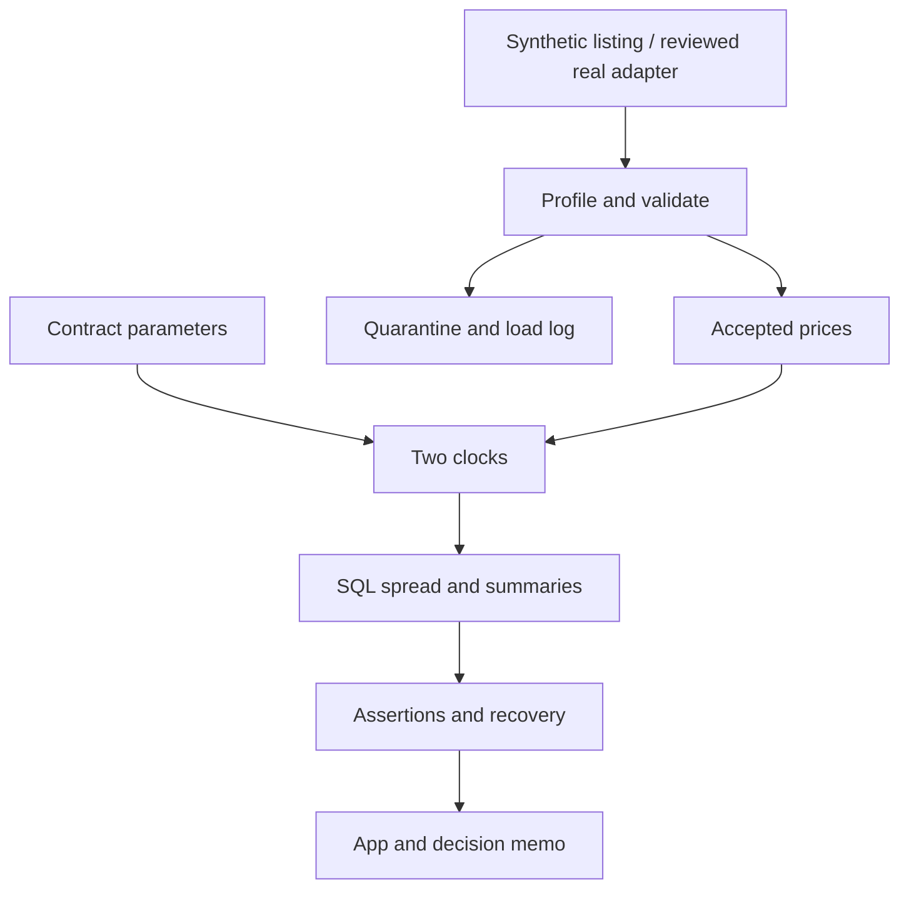
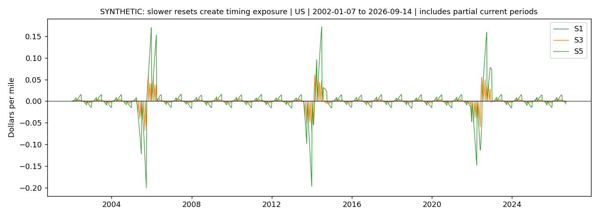

# Fuel Surcharge Policy and Exposure Analytics

**PIPELINE ENGINEERING PROJECT • Historical loading recorded • Revised Phase 3 design ready • Revised model implementation pending**

Current direction: compare explicit surcharge policies and explain every calculation. Read the [revised brief](docs/BUILD_BRIEF.md), [Phase 3 specification](docs/PHASE_3_MODEL_SPEC.md), [source evidence](docs/research/fuel_policy_evidence.md) and [next Snowflake steps](docs/SNOWFLAKE_NEXT_STEPS.md). The existing local app and published charts remain the original SYNTHETIC two-clock demonstration.

Latest execution evidence: [Phase 2 real Snowflake loading checkpoint](outputs/phase_2/REAL_SNOWFLAKE_REPORT.md). The uploaded rerun log shows zero inserts/updates and 16,275 retained rows; the duplicate check is empty. Broader loader failure-path tests and automatic operation remain pending.

## Dataset availability comes first

The real source profiled in Snowflake on September 27, 2026 contains **16,275 weekly diesel-price observations across 10 geographies**, with overall coverage from **March 21, 1994 through June 22, 2026**. Regional starting dates differ. These are the observations available in the inspected adapter output, not a claim about the latest data available from EIA elsewhere. The cause of the source's stale tail remains unresolved.

This supports historical scenario analysis. It does not supply shipper/carrier contracts, shipment volumes, invoices or actual brokerage margins. Published charts, app examples and business conclusions in this repository still use **SYNTHETIC** data; real-source profiling does not validate those conclusions on real prices. See [dataset availability and evidence](docs/dataset_availability.md).

## The engineering problem

Build a dependable path from an external price series to explainable comparisons of two surcharge schedules. The dataset is small; the challenge is making that path correct when source formats differ, observations change, a batch contains bad data, or the feed stops updating.

| Engineering challenge | Approach and evidence boundary |
|---|---|
| Adapt the source without coupling every model to its schema | A standardized adapter was profiled; the first historical load was owner-confirmed and the rerun log retains 16,275 rows |
| Rerun loads and handle corrected prices safely | Change detection, merge logic and load logs are implemented and tested locally; uploaded Snowflake evidence records an unchanged rerun with zero inserts/updates; correction tests in Snowflake remain pending |
| Separate rejected data from accepted history | Quarantine, batch blocking and preservation of accepted values are tested on planted errors |
| Translate prices into explainable policy calculations | Revised specification defines policy versions, explicit index dates and exclusions; the existing shared SQL still implements the old synthetic scenarios |
| Explain and reproduce every result | Detailed rows, reconciled summaries, explicit assumptions and a repeatable synthetic run support review |
| Make stale data visible | Freshness is a separate quality signal; historical usability must not imply a live feed |

Ready to explore as a documented sample. Not a production tool or a completed commercial validation. See [current publication status](docs/publication_status.md) for open work. The historical first-person entries in docs/LEARNINGS.md were agent-generated and have not been confirmed as the owner’s personal experience.

## Why this problem interests me

I want to turn external price data and changing commercial rules into calculations a pricing or finance team can inspect and repeat. The difficult work is selecting the right dated observation, applying the right policy version, handling incomplete history and showing why two rules produce different charges.

The proposed initial audience is mid-market shipper pricing and finance teams. Broker comparisons are a second use case when separate customer and carrier terms are available. [Public industry evidence](docs/research/fuel_policy_evidence.md) supports index-based rules and invoice review as practical concerns; the audience remains a hypothesis to validate with practitioners.

The revised model will compare a weekly baseline, additional index lag and monthly resets. All initial numerical policies remain illustrative. “The Broker's Two Clocks” is retained as a historical scenario, not a claim about standard brokerage contracts. Quarterly resets and seasonal clauses are optional stress tests in the old sample. Modeled surcharge differences are not realized savings or total margin.

Start with the [vision](docs/00_vision.md), [decision memo](docs/business_memo.md), [acceptance status](docs/acceptance_status.md) and [industry-readiness checklist](docs/industry_readiness.md).

## Run the original synthetic sample

Python 3.11+ is recommended. Run from the repository root after cloning the `main` branch.

```bash
python -m venv .venv
source .venv/bin/activate
python -m pip install -r local/requirements.txt
python local/run_pipeline.py all
python local/verify_outputs.py
python local/test_pipeline.py
python local/test_app.py
python local/write_reports.py
python -m streamlit run app/streamlit_app.py
```

Windows activation: `.venv\Scripts\activate`. The pipeline itself completed in about 40–43 seconds here; package installation time varies. `all` recreates only the dedicated local SYNTHETIC database and sample files. Never point it at production data.

The local database is excluded from git and rebuilt by the commands above. The parameters, plots and reports use seed 42 and `AS_OF_DATE=2026-09-23`. Audit load timestamps are actual run metadata and may differ across runs.

## Existing synthetic architecture and files


```mermaid
flowchart TD
  A["Synthetic listing / reviewed real adapter"] --> B["Profile and validate"]
  B --> C["Accepted prices"]
  B --> D["Quarantine and load log"]
  E["Contract parameters"] --> F["Two clocks"]
  C --> F
  F --> G["SQL spread and summaries"]
  G --> H["Assertions and recovery"]
  H --> I["App and decision memo"]
```

- `docs/`: framing, rules, decisions, sources, conclusions and limitations.
- `sql/`: Snowflake deployment scripts; `sql/selects/` holds the shared model logic.
- `local/`: deterministic generator, runner, translation, analyses and tests.
- `data/sample/`: clearly named synthetic CSVs and planted truth.
- `app/`: Streamlit app with local/Snowflake access switch.
- `outputs/phase_0` through `phase_6`: reports, result CSVs, charts and evidence.

## Synthetic verification

| Check | Observed |
|---|---|
| Listing rows including decoys | 14,947 |
| Initial accepted prices | 14,163 |
| Accepted prices after weekly update | 14,174 |
| Six-scenario rows | 85,044 |
| Planted data issues detected | 8 of 8 |
| Invariants | INV-01 to INV-05 passed |
| Planted effects | E1/E2/E3 within specified tolerances |
| Edge cases and model translation | 10 targeted tests passed |
| App | Four pages and alternate scenario selection passed |

These are test results, not findings about EIA prices or company margins. The common-window results show why adverse-week share matters even when average spread is positive. Read the memo for the decision and limits.



| Trap | Handling |
|---|---|
| Missing weeks | Flagged; never filled |
| Exact duplicates | Deduplicated |
| Out-of-range price | Quarantined |
| Null price | Quarantined |
| Tuesday holiday dates | Normalized and logged |
| Decoy series | Rejected from target selection |
| Missing geography metadata | Raw values reveal regions |
| Stale initial tail | Banner/log changes after valid update |

## Snowflake deployment order

**PARTIAL EXECUTION.** The owner completed real-source inspection and adapter validation in Snowflake. The September 27 summary is documented in [dataset availability](docs/dataset_availability.md). The first historical load is owner-confirmed and unchanged-rerun/duplicate exports are recorded in the Phase 2 report. Broader landing failure paths, model refresh, scheduling and app execution remain unverified in Snowflake. Read [the real-source gate](docs/real_source_gate.md) before proceeding; provider lag and scheduling readiness remain open.

1. `sql/00_setup.sql`: administrative setup, small warehouse and resource monitor.
2. `sql/03_seeds.sql`: configuration must exist before profiling or landing. This dependency order corrects the brief’s numeric ordering.
3. Inspect the actual listing, grant the reviewed share access to FUEL_ANALYST, and configure one adapter object in CONFIG.SOURCE_CONFIG. Its columns must match the documented contract. Real names belong only in that configuration.
4. `sql/01_profiling.sql`: record six answers; explicitly approve the source gate.
5. `sql/02_landing.sql`: create procedure and a suspended task. Run a manual CALL, inspect logs, and review the provider-specific cadence before resuming.
6. **Revised Phase 3:** follow [SNOWFLAKE_NEXT_STEPS.md](docs/SNOWFLAKE_NEXT_STEPS.md). Only the read-only `sql/03a_policy_preflight.sql` is ready for the revised track. Do not run the old `04_dynamic_tables.sql`, `04b_quality_views.sql` or `05_validation.sql` as the new model; their replacement implementation is pending.
7. Revised app integration follows policy-model validation. The existing app reads legacy objects and has not been migrated; do not deploy it as the revised policy explorer.
8. Intentional teardown only: `sql/99_teardown.sql`. It deletes all dedicated project objects. It has not been executed in Snowflake.

`python local/render_snowflake.py` regenerates only the legacy synthetic-model dynamic-table SQL. Round-trip translation tests support model equivalence but cannot certify Snowflake procedure behavior or permissions. See [dialect notes](local/dialect_notes.md).

## Review workflow

The repository is public. Changes reach main through pull requests, with phase commits retained for review. See the [phase file map](docs/phase_file_map.md), [original audit](outputs/review/AUDIT_SUMMARY.md) and [current publication status](docs/publication_status.md). The audit describes its original snapshot; current status records subsequent fixes and open items. A final release tag is deferred until the remaining acceptance gaps are resolved.

## Limits and disclosure

All schedule values are illustrative. The regions overlap. Observations are equally weighted, not actual load volumes. The centered seasonal measure uses future data and is descriptive. The sample preserves accepted history on invalid corrections and does not silently propagate provider deletions. Live freshness, contract rules, source terms, cost behavior and operational permissions require real deployment evidence.

The sample build in this repository was generated with AI assistance on synthetic data to test the method end to end. The problem framing, business rules, and validation design are the author's. The real-price run will produce historical scenario findings, not verified commercial outcomes.

## Author and license

Project owner: Sai Tarun Reddy. Built with AI assistance as disclosed above. Licensed under the [MIT License](LICENSE).
