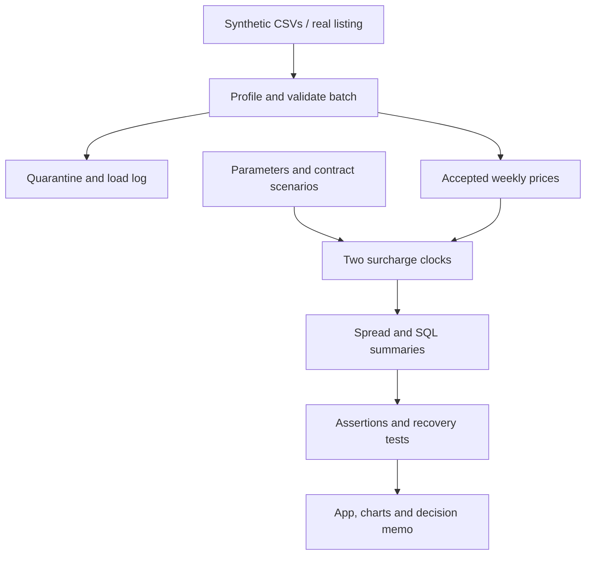

# Architecture

The local twin runs in DuckDB. Snowflake roles, warehouse, monitor, procedure, task and dynamic tables are deployment code only. Real-source profiling must pass before any production landing.
