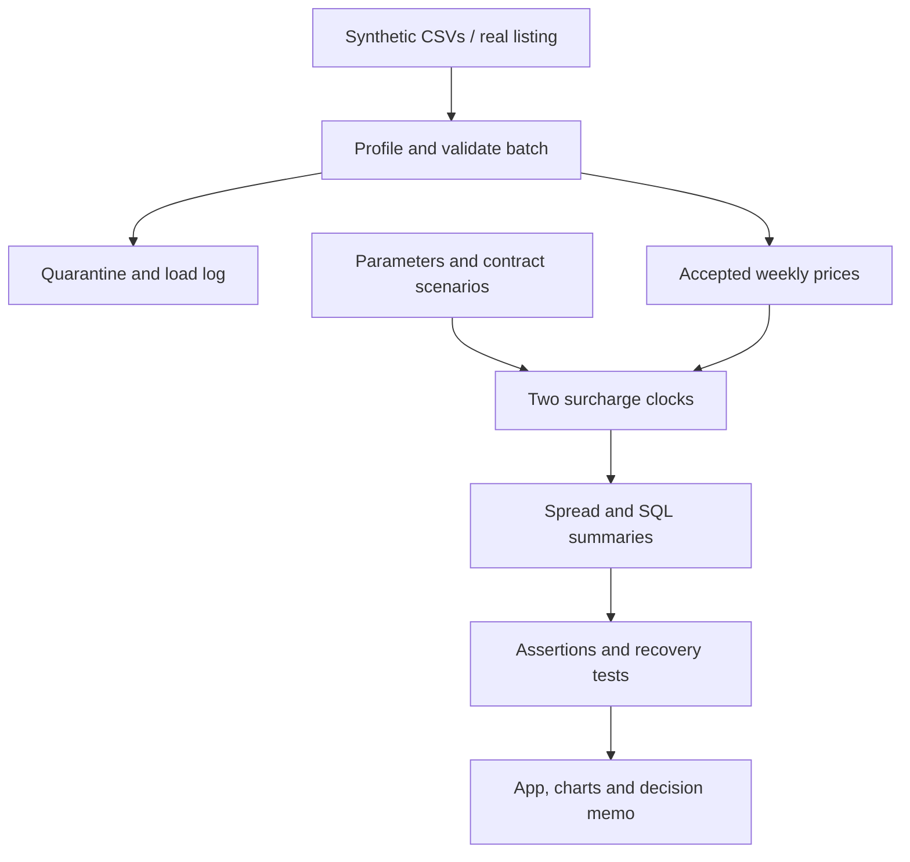

> **Scope update, September 27, 2026:** The material below describes the original SYNTHETIC two-clock implementation. For the revised real-source track, use [the current brief](BUILD_BRIEF.md) and [Phase 3 policy specification](PHASE_3_MODEL_SPEC.md). These legacy rules, requirements and object names do not define the new model.

# Architecture

```mermaid
flowchart TD
  A["Synthetic CSVs / real listing"] --> B["Profile and validate batch"]
  B --> C["Quarantine and load log"]
  B --> D["Accepted weekly prices"]
  E["Parameters and contract scenarios"] --> F["Two surcharge clocks"]
  D --> F
  F --> G["Spread and SQL summaries"]
  G --> H["Assertions and recovery tests"]
  H --> I["App, charts and decision memo"]
```

The local twin runs in DuckDB. Snowflake roles, warehouse, monitor, procedure, task and dynamic tables are deployment code only. Real-source profiling must pass before any production landing.
